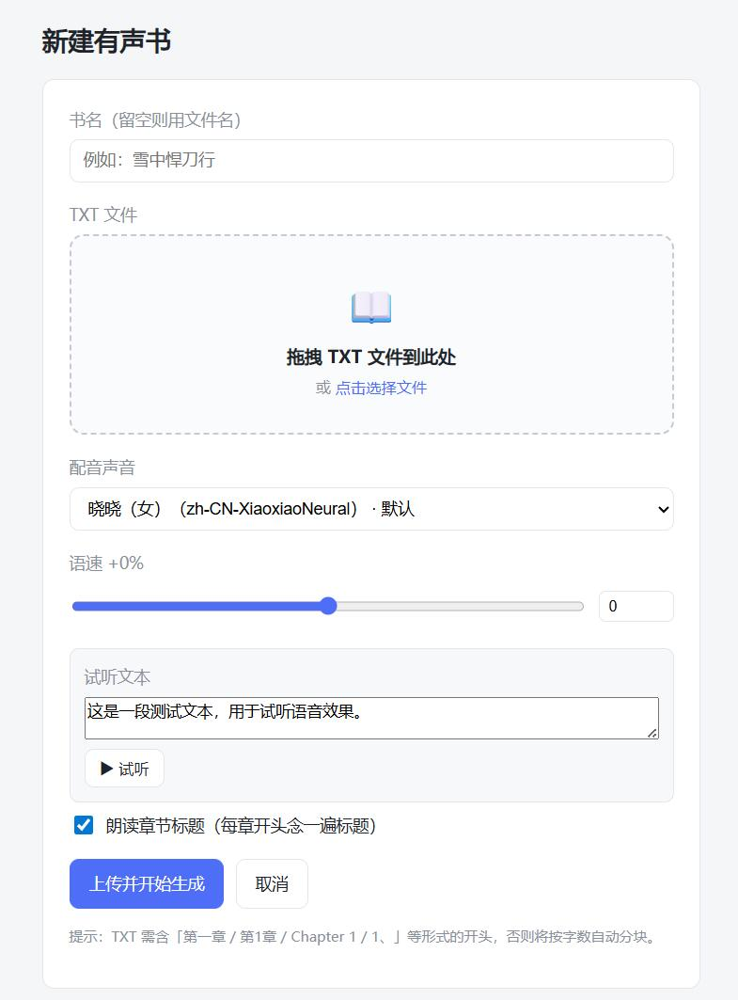

# BookToVoice

> TXT 小说 → 章节切分 → Edge-TTS → 章节 MP3

独立的 Docker 服务：上传 TXT 小说，自动切分章节，逐章用 **Edge-TTS**（微软）合成 MP3，单旁白配音（默认**晓晓**）、串行生成，自带 Web UI。

**直连 Edge-TTS**：内置 Python `edge-tts` 库，不依赖 EasyVoice 或任何外部 TTS 容器，单容器即可运行。

> 想自己**构建镜像 / 本地开发 / 看架构与 API**？请阅 [开发文档](docs/DEVELOPMENT.md)。

---

## 界面预览

**新建有声书**（上传 TXT、选声音、调语速、试听）：



**书籍详情 / 生成进度**（进度条、章节状态、试听 / 下载 / 重生）：


---

## 目录

- [部署](#部署)
- [使用流程](#使用流程)
- [访问地址](#访问地址)
- [配置（声音 / 语速等）](#配置声音--语速等)
- [声音说明](#声音说明)
- [故障排查](#故障排查)
- [数据与备份](#数据与备份)

---

## 部署

> **推荐方式**：直接拉取 GHCR 镜像，无需在本机构建。NAS 装 Docker + Docker Compose 即可（群晖装 Container Manager 即含），端口 `3033` 可用，容器能访问外网（连微软 Edge TTS）。

放一份 `docker-compose.yml`（`volume` 路径换成你 NAS 的）：

```yaml
services:
  book-service:
    image: ghcr.io/weizheng829/booktovoice:latest
    container_name: book-service
    ports:
      - 3033:3033
    volumes:
      - /volume2/SSD/docker/bookToVoice/input:/app/input
      - /volume2/SSD/docker/bookToVoice/output:/app/output
      - /volume2/SSD/docker/bookToVoice/data:/app/data
    restart: always
```

```bash
cd /volume2/SSD/docker/bookToVoice
docker compose pull        # 拉取最新镜像（自动选 amd64/arm64）
docker compose up -d       # 启动 / 重建容器
```

镜像会按 NAS 架构自动匹配，**x86 机器和 ARM NAS（RK3588 等）都能直接用**。

> - `input/ output/ data/` 不用提前建，compose 启动时自动创建。
> - 若仓库为 private，拉取前需先 `docker login ghcr.io`（用 personal access token，权限勾 `read:packages`）。

**更新到最新版**（CI 跑完后在 NAS 执行）：

```bash
docker compose pull && docker compose up -d
docker image prune -f      # 可选：清理旧镜像
```

只锁定某个版本（打 tag `v1.2.0` 时产出 `:1.2.0`），把 `image` 改成 `ghcr.io/weizheng829/booktovoice:1.2.0`。

> 不能联网拉镜像、只能导入离线镜像包（`.tar.gz`）？参见 [开发文档 · 打包 + 部署（离线镜像）](docs/DEVELOPMENT.md#打包--部署离线镜像)。

---

## 使用流程

1. **新建有声书**：上传 TXT → 填书名 → 选声音（默认晓晓）→ ☑ 朗读章节标题（默认开）→ 上传并开始生成。
2. **详情页**：进度条 + 章节状态表，每 3 秒自动刷新。
3. **完成后**：单章「▶ 试听/下载」，或「⬇ 打包下载 ZIP」。
4. **失败处理**：单章「重生」，或「↻ 重试所有失败章」。
5. **设置**：详情页可改声音 / 朗读标题（仅影响未生成章节）。
6. **暂停/继续**：详情页「⏸ 暂停生成」可停止后续章节（当前正在合成的一章会跑完再停）；「▶ 继续生成」恢复。

---

## 访问地址

`<NAS_IP>` 替换为 NAS 局域网 IP。

| 用途                  | URL                                            |
| --------------------- | ---------------------------------------------- |
| **书架主页**          | `http://<NAS_IP>:3033/`                        |
| 新建有声书（上传 TXT）| `http://<NAS_IP>:3033/books/new`               |
| 某 book 详情页        | `http://<NAS_IP>:3033/books/<book_id>`         |
| 全书打包下载          | `http://<NAS_IP>:3033/books/<book_id>/download`|
| 单章下载/试听         | 见详情页按钮                                   |

---

## 配置（声音 / 语速等）

`docker-compose.yml` 默认**不写 `environment`**，直接用内置默认值（晓晓、`+0%`、朗读标题开、重试 3 次）。如需覆盖，给 `book-service` 加一个 `environment:` 段，改完执行 `docker compose up -d`：

```yaml
    environment:
      - DEFAULT_VOICE=zh-CN-YunxiNeural
      - NARRATE_TITLE_DEFAULT=false
```

| 变量                    | 默认                   | 说明                   |
| ----------------------- | ---------------------- | ---------------------- |
| `DEFAULT_VOICE`         | `zh-CN-XiaoxiaoNeural` | 默认声音（晓晓）       |
| `DEFAULT_RATE`          | `+0%`                  | 默认语速               |
| `NARRATE_TITLE_DEFAULT` | `true`                 | 新建书默认是否朗读标题 |
| `MAX_RETRIES`           | `3`                    | 单章最大重试次数       |

> 也可不改全局默认，在**新建有声书 / 详情页设置**时为每本书单独选声音与开关。

---

## 声音说明

- 使用微软 Edge 浏览器的 TTS 接口，**免费、无需 API Key**。
- 常用中文声音：`zh-CN-XiaoxiaoNeural`（晓晓，女）、`zh-CN-YunxiNeural`（云希，男）等。
- 语速格式为百分比（如 `+50%` / `-20%`）。
- 容器内执行 `edge-tts --list-voices` 可查全部声音。

---

## 故障排查

| 现象                           | 排查                                                                                                              |
| ------------------------------ | ----------------------------------------------------------------------------------------------------------------- |
| 章节合成失败                   | `docker compose logs -f book-service` 看错误；多为到微软的网络波动，会自动重试                                     |
| 端口 `3033` 被占用             | 改 compose 里 `ports` 的宿主机端口                                                                                |
| 上传后提示「未解析到任何章节」 | TXT 缺 `第X章`/`Chapter N` 标题；正常会按字数兜底分块                                                             |
| TXT 中文乱码                   | 已支持 utf-8/gb18030/big5 等多编码自动识别；如仍乱码，把文件另存为 UTF-8                                          |
| 中断后想继续                   | 直接重新启动即可——已生成的 mp3 会自动跳过                                                                         |
| 生成的 mp3 在哪                | 宿主机 `output/<书名>/` 目录                                                                                      |

镜像导入 / 架构报错等部署相关问题见 [开发文档](docs/DEVELOPMENT.md)。

---

## 数据与备份

- 上传的原始 TXT：`input/`
- 生成的章节 MP3：`output/`
- 数据库（书籍/章节状态）：`data/book.db`

迁移或备份：拷贝整个项目目录（含 `input/output/data`）即可。
